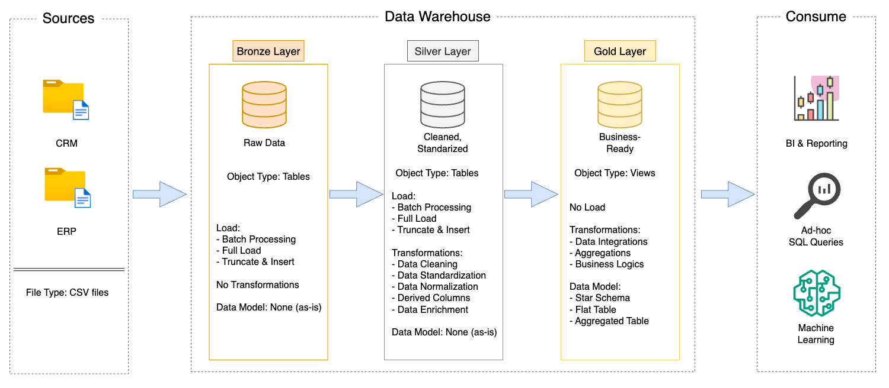

# Sales Data Warehouse Project

## Project Overview
This project presents a comprehensive data warehousing and analytics solution developed using SQL. It demonstrates the full data pipeline - from raw data ingestion to structured analysis - and highlights key competencies in data modeling, ETL processes, and business intelligence. The goal is to transform raw sales data into actionable insights through a scalable medallion architecture.

Key Components:
  1. **Data Architecture:** Implemented the medallion architecture with Bronze (raw), Silver (cleansed), and Gold (business-ready) layers to structure data processing and analytics.
  2. **ETL Pipelines:** Designed and developed ETL processes to extract, transform, and load data from multiple source systems (CRM & ERP) into a centralized SQL Server warehouse.
  3. **Data Modeling:** Created a star schema by building optimized fact and dimension tables to support fast and efficient analytical queries.

## Data Architecture Layers

The data architecture for this project uses **Medallion architecture** (Bronze, Silver, and Gold):

- **Bronze:**
  - Raw ingestion of data with minimal transformation.
  - Stores raw data from the source systems.
  - Convert CSV data files into SQL Server Database
- **Silver:**
  - Cleaned and enriched data used for analytics.
  - Includes data cleansing, standarization, and normalization process to prepare data for analysis.
- **Gold:**
  - Created aggregated and business-ready tables in a star schema for user-friendly reporting and dashboarding.

## Project Requirements

### Building the Data Warehouse (Data Engineering)

Develop a data warehouse using SQL Server to combine sales data, enabling analytical reporting and informed decision-making. 

- **Dataset:** Import raw data files from two sources systems
  - CRM: cust_info.csv, prd_info.csv, sales_details.csv
  - ERP: cust_az12.csv, loc_a101.csv, px_cat_g1v2.csv
- **Data Cleaning:** Resolves data quality issues prior to analysis
- **Data Integration:** Combine both sources into a single, user-friendly model designed
  
### Business Analytics & Reporting (Data Analysis)

Develop SQL-based analytics to deliver detailed insights.
- Customer Behavior
- Product Performance
- Sales Trends

These insights empower stakeholders with meaningful business metrics to guide strategic decision-making.

### Technologies Used
- **SQL Server (Docker Container):** For hosting and managing the relational data warehouse.
- **Visual Studio Code:** Primary development environment for writing SQL scripts and managing data workflows.
- **T-SQL:** For querying, transforming, and analyzing data.
- **CSV Files:** Source data format ingested.
